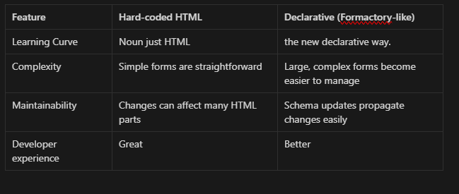

# Introduction

Formactory is a JavaScript/TypeScript library that revolutionizes form building. It replaces cumbersome hard-coded HTML with a declarative JSON schema, dramatically enhancing the maintainability of large, complex forms.

## Key Features

- Schema-Driven: Define form structure and elements in a clear, concise JSON format.
- Extensibility: Seamlessly use standard HTML elements, custom components, or your favorite UI library components.
- React Hook Form Integration: Leverage the power of react-hook-form for efficient form management.
- Validation Ready: Integrate with validation libraries like Zod for robust data validation.

## Why Formactory?

Increased Maintainability: Manage even the most complex forms with ease. Schema updates make form-wide changes a breeze.
Improved Developer Experience: Focus on form logic, not HTML wrangling.
Example (React Hook Form, Zod)

## Comparison

## Getting Started

### Installation

### Basic Usage

### Advanced Usage

### Contract Reference

